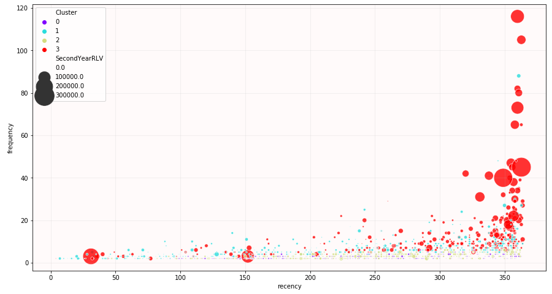
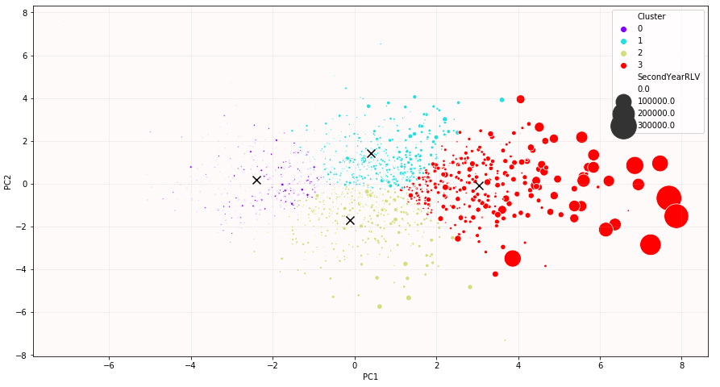
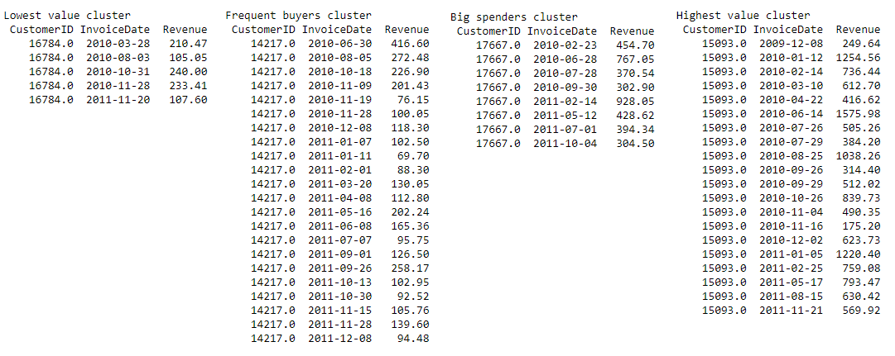
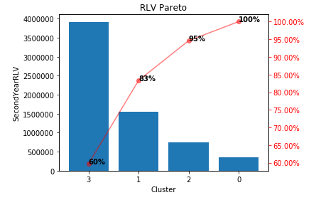

# 1. Customer Segmentation

An analysis of 2 years of transaction history from a real UK based online retail. Both years of the dataset can be found on the UCI Machine Learning Repository ([first year](https://archive.ics.uci.edu/ml/datasets/Online+Retail+II), [second year](https://archive.ics.uci.edu/ml/datasets/Online+Retail)).

The notebook shows that clustering customers based on their RFM isn't able to group together high second year spenders as well as simply clustering on monetary daily aggregate statistics such as Mean/Min/Max/Sum/StDev purchase amount per transaction day (multiple purchases on the same day are grouped together into 1 transaction).

**Notes/Future Work**

- Customers were clustered based on their first year transactions whilst the segmentation was evaluated based on their second year transactions.
- Other features could also be added to the clustering feature set depending on what retailers believe to be important when segmenting their customers. For example, a similar segmentation to the RFM clustering could be achieved when adding recency/frequency statistics to the monetary aggregate features. This will recreate the banding seen in the RFM clustering RF plot.
- Different clustering algorithms and/or number of clusters could also be experimented with to further segment customer bases into groups that suit a certain retail better.

  
  

