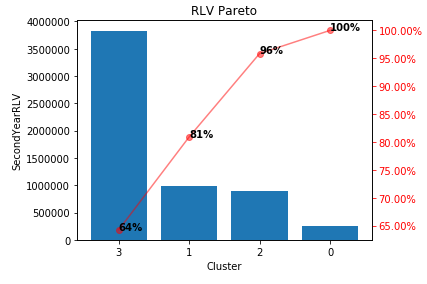

# Customer Segmentation

  
  

An analysis of 2 years of transaction history data from a real UK based online retailer. Both years of the dataset can be found on the UCI Machine Learning Repository ([first year](http://archive.ics.uci.edu/ml/datasets/Online+Retail+II), [second year](http://archive.ics.uci.edu/ml/datasets/Online+Retail)).

The analysis shows that highly profitable customer groups can be identified by segmenting customers based on their first year purchasing behaviour. The highest value customer groups ended up making the largest number of high value purchases in the second year. Attempting to segment customers into value groups based on their RFM statistics resulted in notable second year outliers which were customers identified to be low value but ended up purchasing a large amount in their second year. Using a GMM to perform clustering allowed for more versatile cluster geometries which captured different customer segments. 

The key advantages of GMMs over KMeans are:

1) Soft clustering (observations are assigned cluster probabilities) 
2) More versatile cluster geometry (KMeans results in spherical clusters)
3) Model selection (GMM can select the best number of clusters and cluster shape)

GMM Segmentation with model selection was attempted in a separate notebook. This took the guess work out of selecting the number of clusters and resulted in more unique customer segments to be discovered. 

**Notes/Future Work**

- Customers were segmented based on their first year transactions whilst the segmentation was evaluated based on their second year transactions.
- Other features could be used to segment the customers depending on the marketing strategy and what customer behaviour is trying to be understood. Due to limitations of the dataset, purchasing behaviour was the only features that could be produced.
- Other clustering algorithms could be experimented with to produce different segmentation geometry that might cluster the customer base into more useful groups. 

## Installation

Simply clone the repo and install all dependencies listed in the requirements.txt file to an environment of your choice.

## Usage

All results and plots can be reproduced using the clustering_daily.ipynb notebook. GMM with model selection analysis and intepretation of the model selected clusters can be found in the gmm_with_model_selection.ipynb notebook.
